# ViewStateKit

A small, cross-platform Swift package to model **screen state** and render it in SwiftUI using a single source of truth.

ViewStateKit helps you replace multiple UI flags (`isLoading`, `hasError`, `isEmpty`) with a clear and expressive state model that works consistently across Apple platforms.

- ✅ Simple `ViewState` enum
- ✅ SwiftUI renderer with sensible defaults
- ✅ Designed for **Swift 6 + Observation**
- ✅ iOS, macOS, tvOS and watchOS examples included

---

## Features

- Single source of truth for UI state
- Zero-configuration SwiftUI rendering
- Centered loading / empty / error states by default
- Native `ContentUnavailableView` support
- Seamless integration with `@Observable`
- Fully cross-platform (iOS, macOS, tvOS, watchOS)

---

## Screenshots

### iOS
| Loading | Content | Empty | Error |
| --- | --- | --- | --- |
| 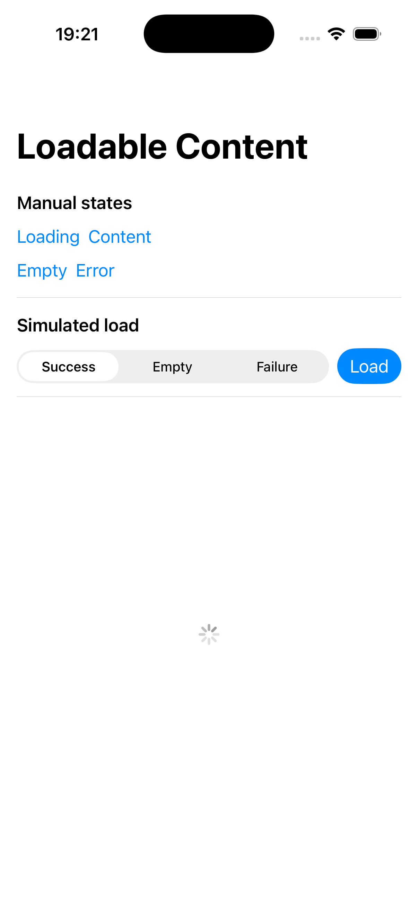 | 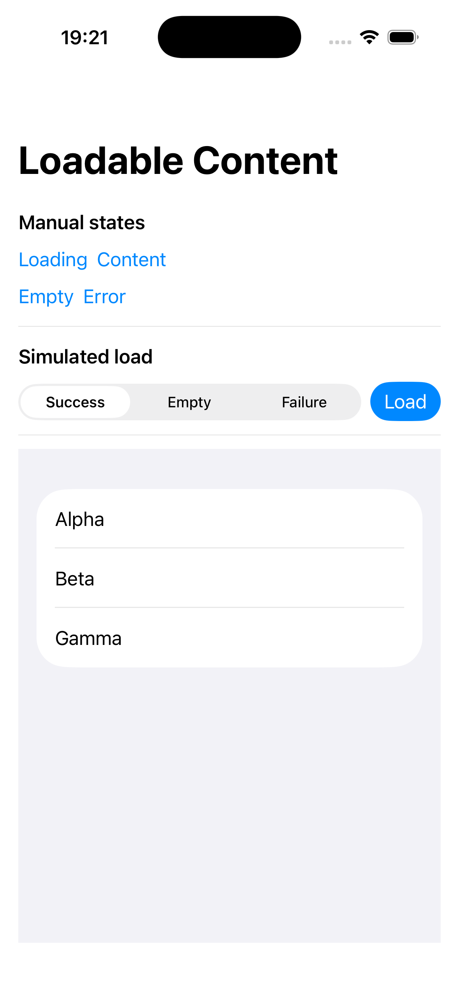 | 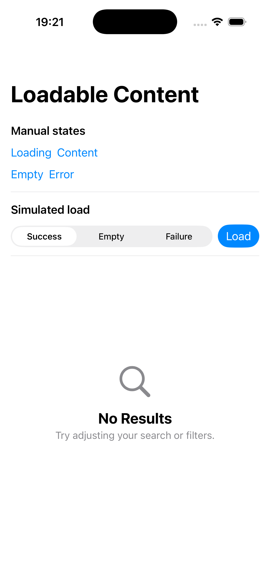 |  |

### macOS
| Loading | Content |
| --- | --- |
| 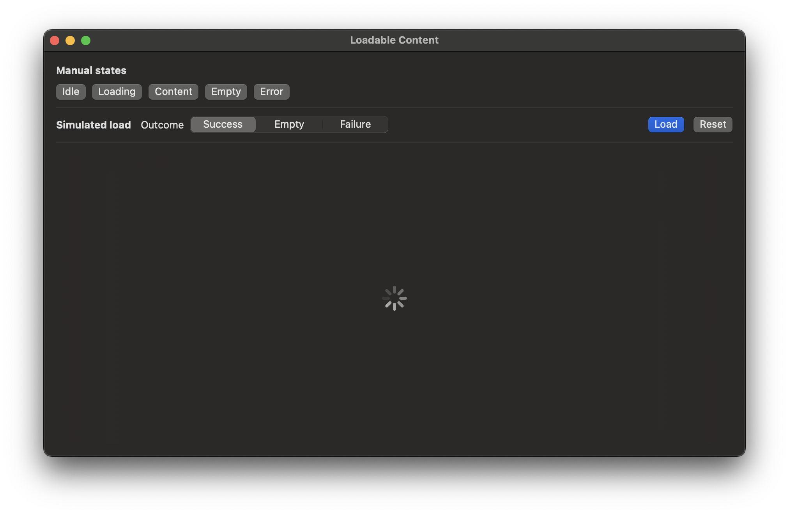 | 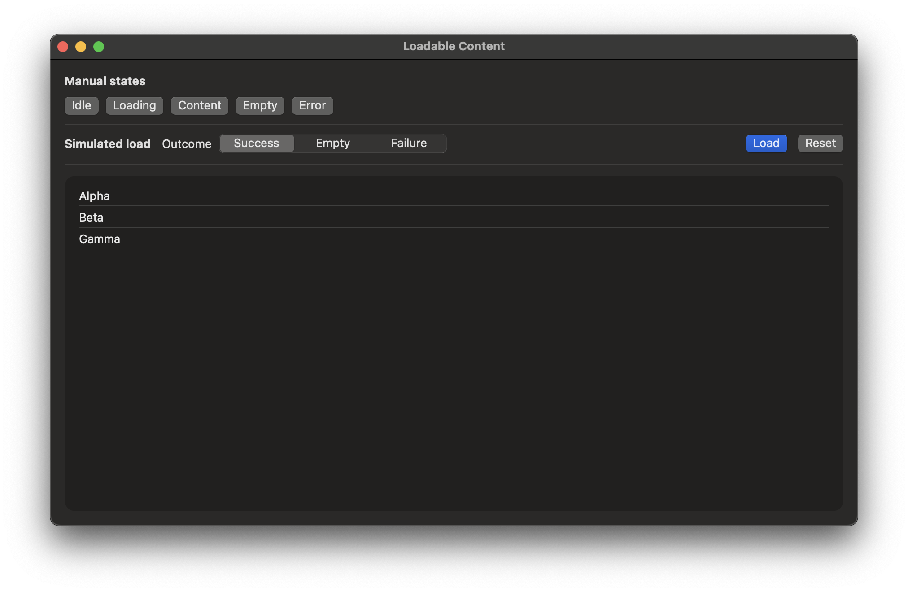 |

| Empty | Error |
| --- | --- |
| 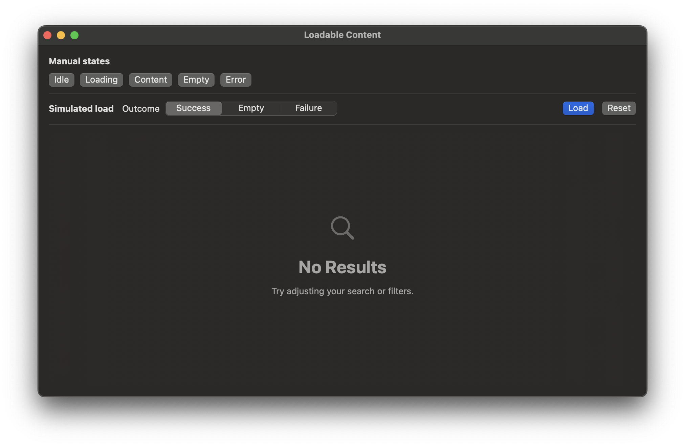 | 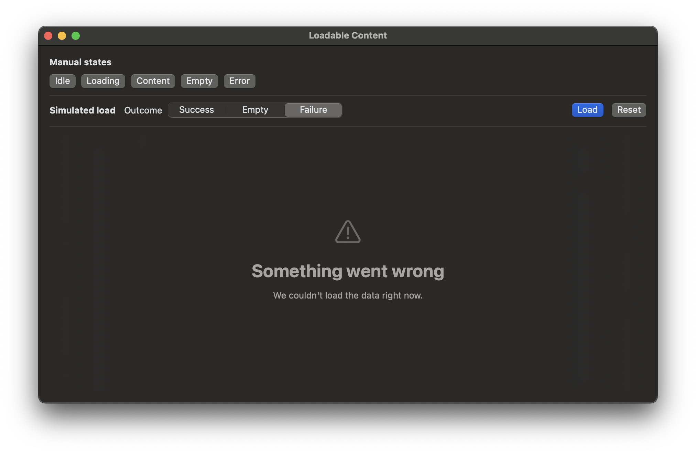 |

### tvOS
| Loading | Content |
| --- | --- |
|  |  |

| Empty | Error |
| --- | --- |
|  |  |

### watchOS
| Loading | Content | Empty | Error |
| --- | --- | --- | --- |
| 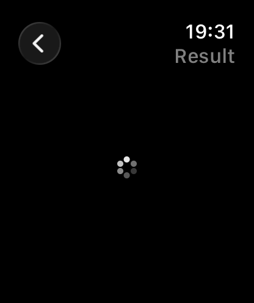 | 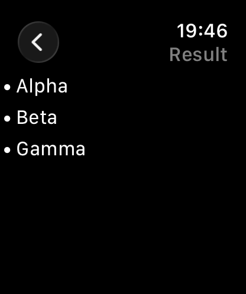 | 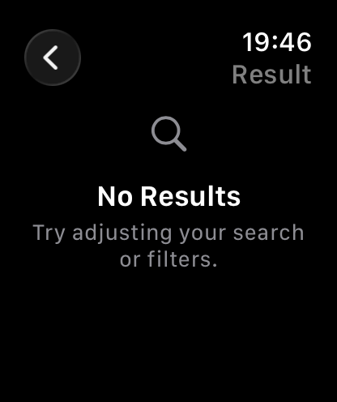 | 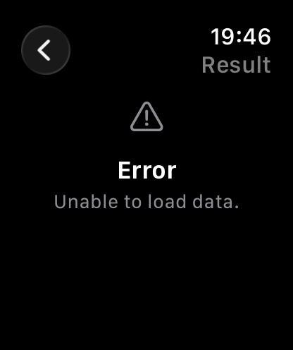 |

---

## Installation

### Swift Package Manager (Xcode)

`File → Add Package Dependencies...` and paste the repository URL.

### Swift Package Manager (`Package.swift`)

```swift
.package(
    url: "https://github.com/rgmez/ViewStateKit",
    from: "0.1.0"
)
```

---

## Quick Start

### Model your UI state

```swift
import Observation
import ViewStateKit

@MainActor
@Observable
final class MyViewModel {
    private(set) var state: ViewState<[String]> = .idle

    func load() async {
        state = .loading
        // fetch data…
        state = .content([...])
    }
}
```

### Render it in SwiftUI

```swift
import SwiftUI
import ViewStateKit

struct MyScreen: View {
    @State private var viewModel = MyViewModel()

    var body: some View {
        StateDrivenView(state: viewModel.state) { items in
            List(items, id: \.self) {
                Text($0)
            }
        }
        .task {
            await viewModel.load()
        }
    }
}
```

That’s it.  
Loading, empty and error states are handled automatically.

---

## Philosophy

**UI should be a pure function of state.**

Instead of juggling multiple flags:

- `isLoading`
- `hasError`
- `isEmpty`

you model your screen with a single value:

```swift
ViewState<Content>
```

and let the view react to it.

---

## API Overview

### ViewState

`ViewState` represents the complete state of a screen:

- `.idle`
- `.loading`
- `.content(Content)`
- `.empty(EmptyReason?)`
- `.error(ViewError)`

---

### StateDrivenView

`StateDrivenView` is a SwiftUI renderer that switches over `ViewState`:

```swift
StateDrivenView(state: viewModel.state) { content in
    // content view
}
```

It ships with default placeholders for loading, empty and error states, so you can get started with zero configuration.

---

## Customization

You can override any placeholder when needed:

```swift
StateDrivenView(
    state: viewModel.state
) { items in
    List(items, id: \.self) { Text($0) }
} loading: {
    ProgressView("Loading…")
} empty: { _ in
    Text("Nothing here")
} error: { error in
    VStack {
        Text(error.title)
        Text(error.message)
    }
}
```

---

## Examples

This repository includes example apps for each platform:

- **iOS** – state-driven list with fixed controls
- **macOS** – desktop layout with shared logic
- **tvOS** – focus-friendly controls and grid content
- **watchOS** – two-screen flow optimized for small displays

See the `Examples/` directory.

---

## Requirements

- Swift 6
- SwiftUI
- iOS 17+
- macOS 14+
- tvOS 17+
- watchOS 10+

---

## Repository Structure

```txt
Sources/
  ViewStateKit/
    ViewState.swift
    StateDrivenView.swift
    StateDrivenPlaceholders.swift

Examples/
  iOSExampleApp/
  macOSExampleApp/
  tvOSExampleApp/
  watchOSExampleApp/

README/
  Images/
```

---

## License

MIT License.  
See `LICENSE` for details.
