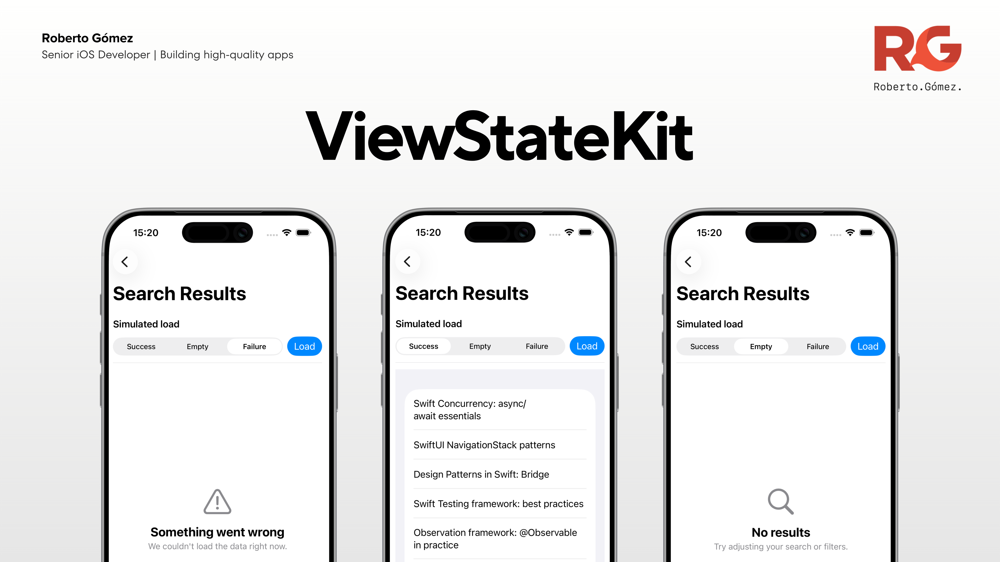

# ViewStateKit

<p align="center">
  
</p>

A small, cross-platform Swift package to model **screen state** and render it in SwiftUI using a single source of truth.

ViewStateKit replaces multiple UI flags (`isLoading`, `hasError`, `isEmpty`) with one expressive enum that scales from simple screens to complex flows.

- ✅ Generic `ViewState<Content, ErrorState, EmptyState>`
- ✅ SwiftUI renderer (`StateDrivenView`) with sensible defaults
- ✅ Designed for **Swift 6 + Observation**
- ✅ iOS, macOS, tvOS and watchOS examples included

---

## Why?

UI should be a pure function of state.

Instead of juggling multiple flags like:

- `isLoading`
- `hasError`
- `isEmpty`

you model your screen with a single value:

```swift
ViewState<Content, ErrorState, EmptyState>
```

and let the view react to it.

---

## Features

- Single source of truth for UI state
- Generic state model (you choose the error/empty types)
- Helpers for common queries (`isLoading`, `hasContent`, etc.)
- `map` / `flatMap` for state transformations
- `StateDrivenView` to render state-driven SwiftUI screens
- Cross-platform (iOS, macOS, tvOS, watchOS)

---

## Requirements

- Swift 6
- SwiftUI
- iOS 17+
- macOS 14+
- tvOS 17+
- watchOS 10+

---

## Installation

### Swift Package Manager (Xcode)

`File → Add Package Dependencies…` and paste the repository URL.

### Swift Package Manager (`Package.swift`)

```swift
.package(
  url: "https://github.com/rgmez/ViewStateKit",
  from: "0.1.0"
)
```

---

## Core Types

### `ViewState`

`ViewState` represents the complete state of a screen:

- `.idle`
- `.loading`
- `.content(Content)`
- `.empty(EmptyState)`
- `.error(ErrorState)`

```swift
public enum ViewState<Content, ErrorState, EmptyState> {
  case idle
  case loading
  case content(Content)
  case empty(EmptyState)
  case error(ErrorState)
}
```

### Display Models

ViewStateKit includes two ready-to-use "presentation" models:

- `ErrorDisplayModel` – user-facing error info (title/message/recovery)
- `EmptyDisplayModel` – common empty reasons (no results / no data / no connection / custom)

These models are used by the default SwiftUI placeholders.

---

## Quick Start (SwiftUI)

### 1) Create a ViewModel

```swift
import Observation
import ViewStateKit

@MainActor
@Observable
final class SearchResultsViewModel {
  private(set) var state: ViewState<[String], ErrorDisplayModel, EmptyDisplayModel> = .idle

  func load() async {
    state = .loading
    try? await Task.sleep(nanoseconds: 700_000_000)

    state = .content([
      "Swift Concurrency: async/await essentials",
      "SwiftUI NavigationStack patterns",
      "Swift Testing: best practices"
    ])
  }
}
```

### 2) Render with `StateDrivenView`

When your state uses `ErrorDisplayModel` + `EmptyDisplayModel`, `empty` and `error` have sensible defaults:

```swift
import SwiftUI
import ViewStateKit

struct SearchResultsView: View {
  @State private var viewModel = SearchResultsViewModel()

  var body: some View {
    StateDrivenView(state: viewModel.state) { items in
      List(items, id: \.self) { Text($0) }
    }
    .task { await viewModel.load() }
  }
}
```

---

## Customization

Override any placeholder when needed:

```swift
StateDrivenView(state: viewModel.state) { items in
  List(items, id: \.self) { Text($0) }
} empty: { _ in
  Text("Nothing here yet")
} error: { error in
  VStack(spacing: 8) {
    Text(error.title).font(.headline)
    Text(error.message).font(.subheadline)
  }
}
```

You can also provide custom loading/idle views:

```swift
StateDrivenView(state: viewModel.state) { items in
  List(items, id: \.self) { Text($0) }
} loading: {
  ProgressView("Loading…")
} idle: {
  Text("Ready").foregroundStyle(.secondary)
}
```

---

## Removing impossible states (using `Never`)

You can remove "impossible" states for certain screens:

### Screens that can’t fail

If failures are handled upstream (or are impossible), use `Never`:

```swift
typealias NonFailingState<Content, Empty> = ViewState<Content, Never, Empty>
```

### Screens that are never empty

If empty is not meaningful:

```swift
typealias NonEmptyState<Content, Failure> = ViewState<Content, Failure, Never>
```

---

## Helpers

`ViewState` includes common helpers:

- `isLoading`, `hasContent`, `isEmpty`, `hasError`
- `content`, `error`, `emptyState`
- `map` and `flatMap` to transform content while preserving the other states

Example:

```swift
let stringState = intState.map { "\($0)" }
```

---

## Examples

The `Examples/` folder includes a small app per platform showing the same three screen types:

1) **Full state** (supports `.content`, `.empty`, `.error`)
2) **Can't fail** (`Failure == Never`)
3) **Never empty** (`Empty == Never`)

This helps you see how `ViewState` and `StateDrivenView` scale as you "remove" impossible states.

### iOS

- A `HomeView` with navigation to three screens:
  - **Search Results** (full state)
  - **Recent Searches** (can't fail)
  - **Account Summary** (never empty)
- Each screen uses a simple `@Observable` view model and renders state with `StateDrivenView`.

### macOS

- A user-friendly navigation layout that lets you move back to the main menu after opening an example.
- The same three screens as iOS, adapted to macOS UI conventions (toolbar/title handling, list layout).

### tvOS

- The same three examples, adapted for tvOS:
  - Focus-friendly layout
  - Bigger tap targets and list styling
  - Simple navigation between the home menu and each example

### watchOS

- A watch-native flow that avoids the common pitfalls of `Picker(.wheel)` + `ScrollView`.
- Each example is split into:
  - a **Controls** screen (choose an outcome + load)
  - a **Result** screen that displays the current `ViewState`
- Uses `NavigationStack` + `navigationDestination` and renders results in a `List` for stability and readability.

---

## License

MIT License. See `LICENSE`.
